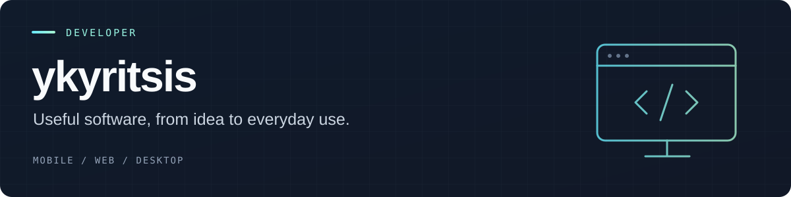

  

  <a href="https://ykcompany.com.au"><b>Portfolio</b></a> &nbsp; / &nbsp;
  <a href="https://www.linkedin.com/in/yiannis-kyritsis-69605b38b/"><b>LinkedIn</b></a> &nbsp; / &nbsp;
  <a href="https://apps.apple.com/au/app/carstomize/id6755451417"><b>CarStomize on the App Store</b></a>

### Hi, I'm Yiannis.

I'm a **recent Bachelor of Computer Science (Professional) graduate seeking
graduate and junior developer opportunities**. My background combines
**data-science experience gained during a work placement** with hands-on projects
across mobile apps, browser extensions and Windows utilities. I've published an
iOS app and share practical tools and experiments here on GitHub.

I'm particularly interested in **AI application development, software engineering
and automation** — building useful products and learning how to make them reliable.

I like working across the whole problem: how something looks, how it behaves,
and what happens when it meets real-world constraints. Cars and PC gaming also
find their way into what I build.

## Selected work

<table>
<tr>
<td width="50%" valign="top">
<h3><a href="https://apps.apple.com/au/app/carstomize/id6755451417">CarStomize</a></h3>

Visualise vehicle customisations — wheels, paint and body styling — in an iOS app available on the App Store.

MOBILE PRODUCT · AUTOMOTIVE VISUALISATION

</td>
<td width="50%" valign="top">
<h3><a href="https://github.com/ykyritsis/ChatGPT-code-preview">ChatGPT Code Preview</a></h3>

A Chrome extension for previewing HTML, CSS and JavaScript inside ChatGPT, with resizable previews and code export.

JAVASCRIPT · BROWSER EXTENSIONS · DEVELOPER TOOLS

</td>
</tr>
<tr>
<td width="50%" valign="top">
<h3><a href="https://github.com/ykyritsis/amd-scaling-hotkeys">AMD Scaling Hotkeys</a></h3>

A Windows tray utility for switching Radeon GPU scaling modes using global hotkeys.

C# · WINDOWS · DESKTOP UTILITIES

</td>
<td width="50%" valign="top">
<h3><a href="https://github.com/ykyritsis/pes-2017-4k-fix">PES 2017 4K Fix</a></h3>

A documented dgVoodoo2 configuration for 4K borderless play, with an optional ReShade preset and notes on experimental results.

PC GAMING · GRAPHICS CONFIGURATION · TROUBLESHOOTING

</td>
</tr>
</table>

Also exploring Android development with **[Conflict Tracker](https://github.com/ykyritsis/conflicttrackerandroidapp)**, built with Kotlin.

## What I bring to a project

- **Product development:** taking an idea through interface design, implementation and iteration.
- **Practical tooling:** browser extensions and desktop utilities that make everyday tasks easier.
- **Integration and investigation:** connecting systems, testing assumptions and documenting what actually works.
- **Curiosity across platforms:** moving between mobile, web and desktop to use the right tools for the problem.

## Technical skills & interests

| Area | Technologies and focus |
| --- | --- |
| Mobile development | Swift / SwiftUI, Kotlin; iOS and Android projects |
| Web & browser tooling | JavaScript, TypeScript, HTML and CSS |
| Desktop development | C#, Windows utilities and workflow improvements |
| Programming & version control | Python, Git and GitHub |
| Data science | Practical experience gained during a work placement |
| Development environments | Conventional IDEs and AI-assisted tools, including Cursor, Windsurf and Codex |
| AI development interests | AI integrations, agents, automation and developer tooling |

I'm comfortable working with both conventional and AI-assisted development
workflows. My projects demonstrate practical implementation, debugging and documentation.
I'm keen to develop those skills further in a team through code review,
mentorship and work on production systems.

---

**Hiring for a graduate or junior developer role?** I'd welcome a conversation
about software, mobile or AI application development opportunities.
See **[my portfolio](https://ykcompany.com.au)** or connect on
**[LinkedIn](https://www.linkedin.com/in/yiannis-kyritsis-69605b38b/)**.
