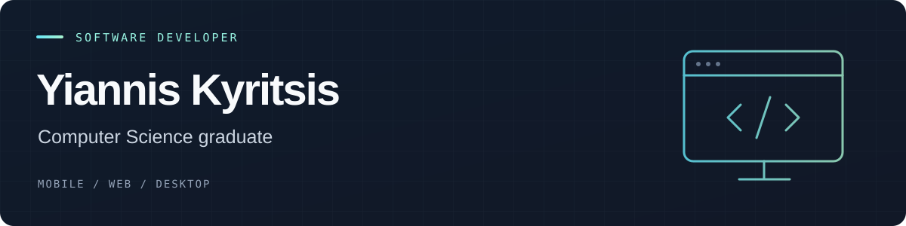

  

  <a href="https://ykcompany.com.au"><b>Portfolio</b></a> &nbsp; / &nbsp;
  <a href="#selected-projects"><b>Selected projects</b></a> &nbsp; / &nbsp;
  <a href="https://apps.apple.com/au/app/carstomize/id6755451417"><b>CarStomize on the App Store</b></a>

## Hi, I'm Yiannis.

I'm a **Computer Science (Professional) graduate** building mobile apps, browser extensions and Windows software. My experience includes a **data-science work placement**, a published iOS app and open-source tools that solve practical problems.

I enjoy taking a product from its first interface through implementation, debugging and iteration. I'm particularly interested in **software engineering, AI application development and automation**.

**Based in Australia · Open to graduate and junior developer opportunities**

## Selected projects

<table>
<tr>
<td width="50%" valign="top">
<h3><a href="https://apps.apple.com/au/app/carstomize/id6755451417">CarStomize</a></h3>

An iOS app for visualising vehicle customisations, including wheels, paint and body styling. Published on the App Store.

<strong>Demonstrates:</strong> mobile product development, interface design and taking an app to release.

iOS · MOBILE DEVELOPMENT · PRODUCT DESIGN

</td>
<td width="50%" valign="top">
<h3><a href="https://github.com/ykyritsis/ChatGPT-code-preview">ChatGPT Code Preview</a></h3>

A Chrome extension that brings HTML, CSS and JavaScript previews into ChatGPT, with resizable panels and code export.

<strong>Demonstrates:</strong> browser integration, interactive interfaces and developer tooling.

JAVASCRIPT · HTML · CSS · CHROME EXTENSIONS

</td>
</tr>
<tr>
<td width="50%" valign="top">
<h3><a href="https://github.com/ykyritsis/xbox-cloud-preview-on-pc">Xbox Preview UI</a></h3>

An unofficial Windows game launcher with controller navigation, library discovery, artwork caching and game detail pages. Available as a community beta.

<strong>Demonstrates:</strong> desktop UI development, service integration and local data handling.

JAVASCRIPT · WINDOWS · CONTROLLER INTERFACES

</td>
<td width="50%" valign="top">
<h3><a href="https://github.com/ykyritsis/amd-scaling-hotkeys">AMD Scaling Hotkeys</a></h3>

A Windows tray utility for switching Radeon GPU scaling modes using global hotkeys and AMD's ADLX display API.

<strong>Demonstrates:</strong> native API integration, desktop utilities and practical workflow automation.

C# · WINDOWS · AMD ADLX

</td>
</tr>
</table>

**More to explore:** [Conflict Tracker](https://github.com/ykyritsis/conflicttrackerandroidapp), an Android project built with Kotlin, and [PES 2017 4K Fix](https://github.com/ykyritsis/pes-2017-4k-fix), a documented graphics configuration and troubleshooting project.

## Technical skills

| Area | Technologies & experience |
| --- | --- |
| Mobile | Swift, SwiftUI and Kotlin · iOS and Android projects |
| Web & browser extensions | JavaScript, TypeScript, HTML and CSS |
| Desktop & integrations | C# · Windows utilities · native APIs and service integration |
| Programming & data | Python · data-science experience from a work placement |
| Development workflow | Git, GitHub · debugging, documentation and iterative development |

## How I work

- **Build around a practical need.** Turn everyday frustrations into focused apps and tools.
- **Connect the interface to the implementation.** Work across user experience, application behaviour and integrations.
- **Investigate and document.** Test assumptions, troubleshoot platform constraints and explain limitations clearly.
- **Keep learning.** Use conventional and AI-assisted development tools, and grow through feedback and code review.

I'm exploring AI integrations, agents and automation, with a focus on useful applications and reliable behaviour.

---

### Let's connect

I'm looking for a **graduate or junior developer role** where I can contribute to software, mobile or AI application projects and learn from an experienced team.

Visit **[my portfolio](https://ykcompany.com.au)** to learn more about my work and get in touch.
